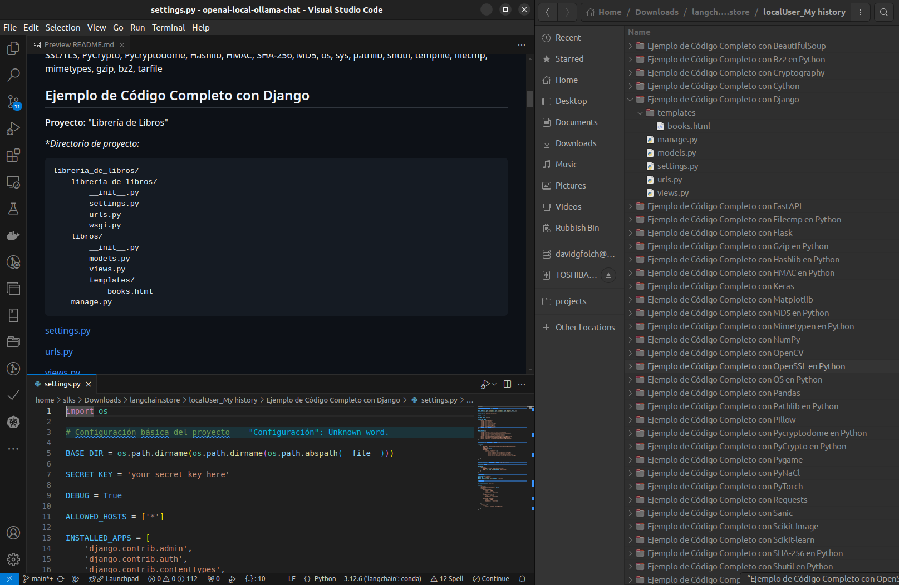

# OpenAI langchain Local Ollama chat

[](https://github.com/davidgfolch/OpenAI-local-ollama-chat/actions/workflows/backend-build-lint-and-tests.yml)
[](backend/README.md#generate-coverage-badge-for-readmemd)

Tech-stack: Vue3 -> Python (langchain/openai) -> Ollama

This project implements a local AI chat, with :

- Response pretty printing: markdown to html & code highlight
  - Formatted response for code blocks (through ability prompt).
- Backend chat history with persistence (file store)
  - Delete question/answer in file history.
  - Delete all history.
- LLM response live streaming: chunked streaming
  - Stop current streaming response.
- Langchain callbacks logging (with truncated text in logs)
- File uploader
  - File uploaded to `uploads` folder as files.
  - Mention file in question to LLM by pressing `@` and choose file from uploaded files assistant.
- Full conversation history export:
  - generating a downloadable zip file
  - extracting code blocks into linked files in the README.md (organized each response in a different folder)
  
- Advanced prompts
  - Multiple requests parametrization:
    - The frontend allows to trigger several questions (sequentially) to the LLM.  You only need to provide a {variable} in the question & set the variable values in a single line, f.ex.:

          Generate a full example code with {variable} in python.

          variable=Django, Flask, NumPy, Pandas, Matplotlib,Scikit-learn, Requests

## Watch the Youtube demo

<a href="https://youtu.be/lzJOmwnY1m4" target="_blank">
    
</a>

## Ollama installation & setup (required)

See [README_OLLAMA.md](README_OLLAMA.md)

## Project run

### Run Ollama and load model

```bash
sudo service ollama start
```

### Run backend & frontend

See respective README.md docs: [backend](backend/README.md) & [frontend](frontend/README.md)

## References

### Langchain

- <https://python.langchain.com/docs/concepts/>
- <https://python.langchain.com/docs/how_to/>
- <https://python.langchain.com/docs/integrations/platforms/openai/>
- <https://python.langchain.com/docs/integrations/chat/ollama/>
- <https://python.langchain.com/api_reference/ollama/index.html>
- <https://api.python.langchain.com/en/latest/llms/langchain_community.llms.ollama.Ollama.html>
- <https://api.python.langchain.com/en/latest/ollama/index.html>
- <https://api.python.langchain.com/en/latest/openai_api_reference.html>

### OpenAI

- <https://github.com/openai/openai-python>
- <https://platform.openai.com/docs/api-reference/introduction>
- <https://platform.openai.com/docs/libraries/python-library>

### Ollama

- <https://github.com/ollama/ollama>
- <https://ollama.com/library>
- <https://www.reddit.com/r/LocalLLaMA/>

## TODO

1. Collapse all responses.
2. Histories endpoint & selector
3. Prompt: `@openai-local-ollama-chat Explicame el proyecto`

    ```log
    ServiceException: op not found, upload it first!
    RuntimeError: Error loading uploads/openai-local-ollama-chat
    IsADirectoryError: [Errno 21] Is a directory: 'uploads/openai-local-ollama-chat'
    ```

4. K-shift error (see [Known-issues](Known-issues)):
   1. Continue doesn't generates K-shift error, checkout how.
   2. Option (front/back) to disable passing all history to LLM.

## Known issues (todo)

### Ollama throws "Deepseek2 does not support K-shift"

When context gets bigger and can't fit into VRAM (after several q/a f.ex.), Ollama throws the following error because Deepseek2 does not support K-shift

```log
ollama[17132]: /go/src/github.com/ollama/ollama/llm/llama.cpp/src/llama.cpp:15110: Deepseek2 does not support K-shift
ollama[17132]: Could not attach to process.  If your uid matches the uid of the target
ollama[17132]: process, check the setting of /proc/sys/kernel/yama/ptrace_scope, or try
ollama[17132]: again as the root user.  For more details, see /etc/sysctl.d/10-ptrace.conf
ollama[17132]: ptrace: Inappropriate ioctl for device.
ollama[17132]: No stack.
ollama[17132]: The program is not being run.
```
