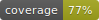
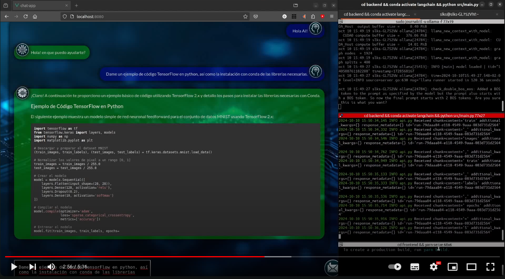

# OpenAI langchain Local Ollama chat

[](https://github.com/davidgfolch/OpenAI-local-ollama-chat/actions/workflows/backend-build-lint-and-tests.yml)
[](backend/README.md#generate-coverage-badge-for-readmemd)

This project implements a local AI chat, with:

- Response pretty printing: markdown to html & code highlight
- Backend chat history with persistence (file store)
- LLM response live streaming: chunked streaming
- Tech-stack: Vue3 -> Python (langchain/openai) -> Ollama

## Watch the Youtube demo

<a href="https://youtu.be/lzJOmwnY1m4" target="_blank">
    
</a>

## Ollama installation & setup (required)

See [README_OLLAMA.md](README_OLLAMA.md)

## Project run

### Run Ollama and load model

```bash
sudo service ollama start
```

### Run backend & frontend

See respective README.md docs: [backend](backend/README.md) & [frontend](frontend/README.md)

## References

### Langchain

- <https://python.langchain.com/docs/concepts/>
- <https://python.langchain.com/docs/how_to/>
- <https://python.langchain.com/docs/integrations/platforms/openai/>
- <https://python.langchain.com/docs/integrations/chat/ollama/>
- <https://python.langchain.com/api_reference/ollama/index.html>
- <https://api.python.langchain.com/en/latest/llms/langchain_community.llms.ollama.Ollama.html>
- <https://api.python.langchain.com/en/latest/ollama/index.html>
- <https://api.python.langchain.com/en/latest/openai_api_reference.html>

### OpenAI

- <https://github.com/openai/openai-python>
- <https://platform.openai.com/docs/api-reference/introduction>
- <https://platform.openai.com/docs/libraries/python-library>

### Ollama

- <https://github.com/ollama/ollama>
- <https://ollama.com/library>
- <https://www.reddit.com/r/LocalLLaMA/>

### Other libraries

- <https://python-markdown.github.io/>
- <https://python-markdown.github.io/reference/>
- <https://github.com/Python-Markdown/markdown/wiki/Third-Party-Extensions>

### Articles & examples

- <https://docs.nvidia.com/ace/latest/modules/ace_agent/tutorials/build-langchain-bot.html>

## TODO

1. Stop button when receiving backend stream response (stoping ollama server execution).
2. Upload file or folder to give context to llm (RAG??).
3. Agents?

## Known issues (todo)

### DeepSeekCoder V2 fails randomly

```log
oct 08 13:05:40 slks-GL752VW ollama[17132]: /go/src/github.com/ollama/ollama/llm/llama.cpp/src/llama.cpp:15110: Deepseek2 does not support K-shift
oct 08 13:05:40 slks-GL752VW ollama[17132]: Could not attach to process.  If your uid matches the uid of the target
oct 08 13:05:40 slks-GL752VW ollama[17132]: process, check the setting of /proc/sys/kernel/yama/ptrace_scope, or try
oct 08 13:05:40 slks-GL752VW ollama[17132]: again as the root user.  For more details, see /etc/sysctl.d/10-ptrace.conf
oct 08 13:05:40 slks-GL752VW ollama[17132]: ptrace: Inappropriate ioctl for device.
oct 08 13:05:40 slks-GL752VW ollama[17132]: No stack.
oct 08 13:05:40 slks-GL752VW ollama[17132]: The program is not being run.
```
